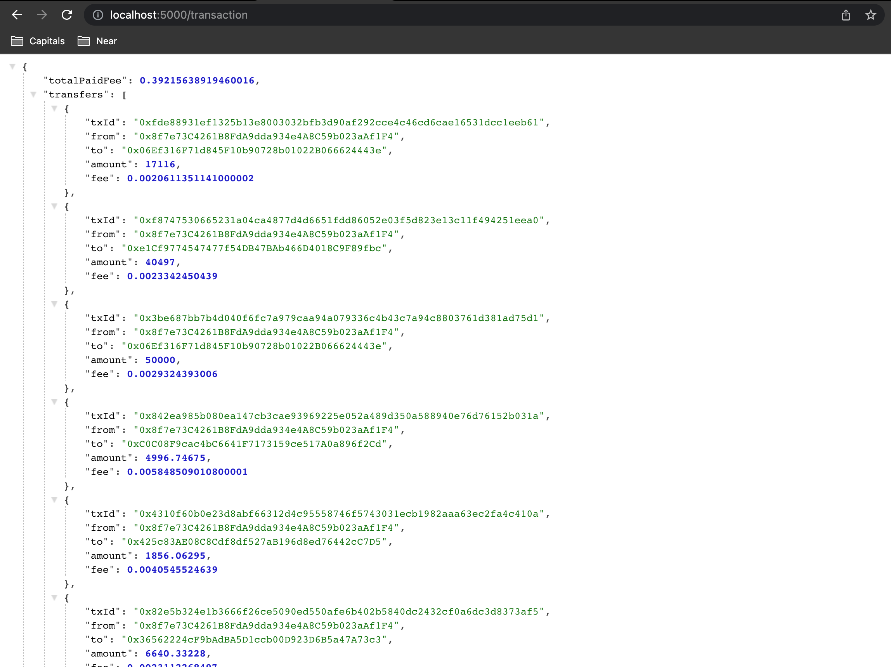
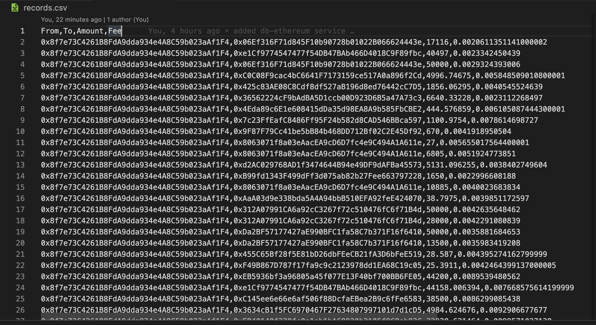

# Bitexen Code Challenge

Projenin çalışması için yapılması gerekenler;

    npm install

    npm run start

Projeyi çalıştırdıktan sonra http://localhost:5000/transaction url'ine Http Get isteği atarak verilere ulaşabilir. Veriler, "records.csv" isimli dosyaya kayıt edilecektir.

Proje, express.js ile oluşturulmuş bir Rest API uygulamasıdır. Node servisi olarak Infura kullanılmıştır.

## Ekran Görüntüleri

